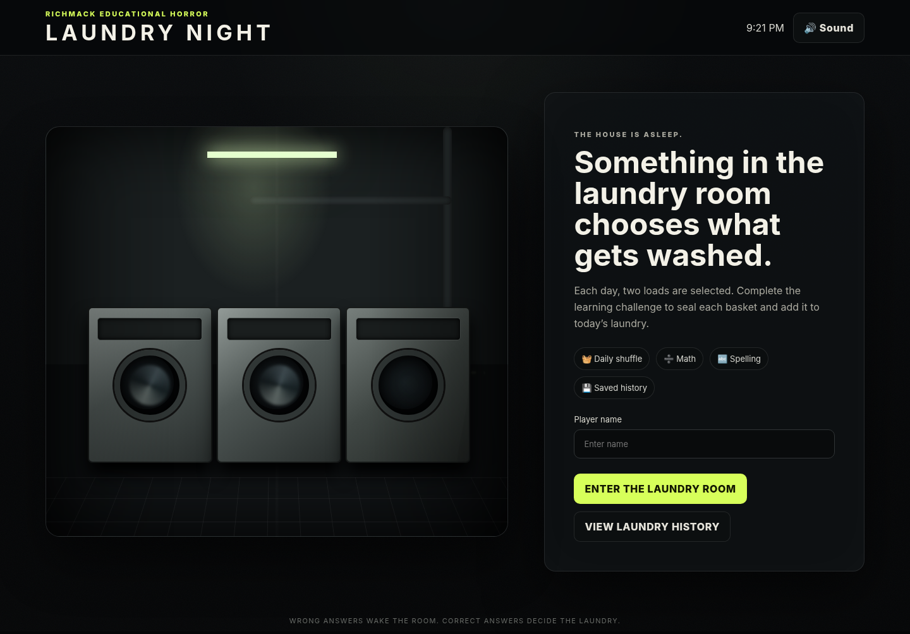
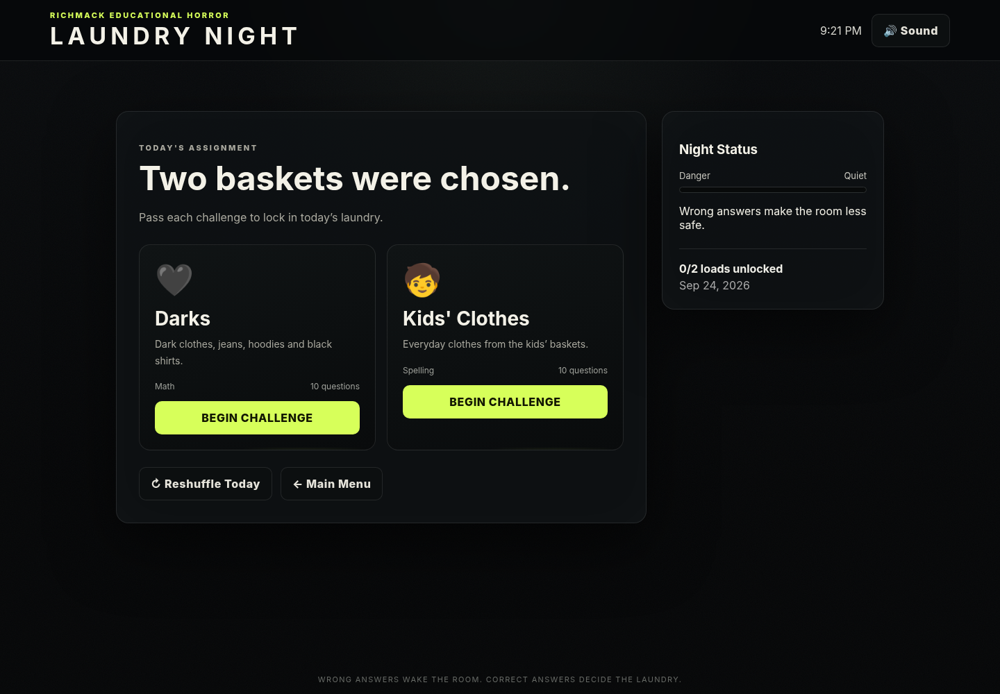
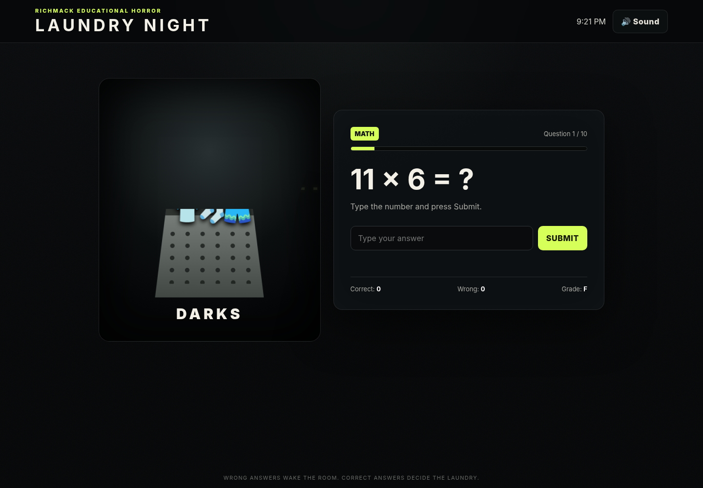
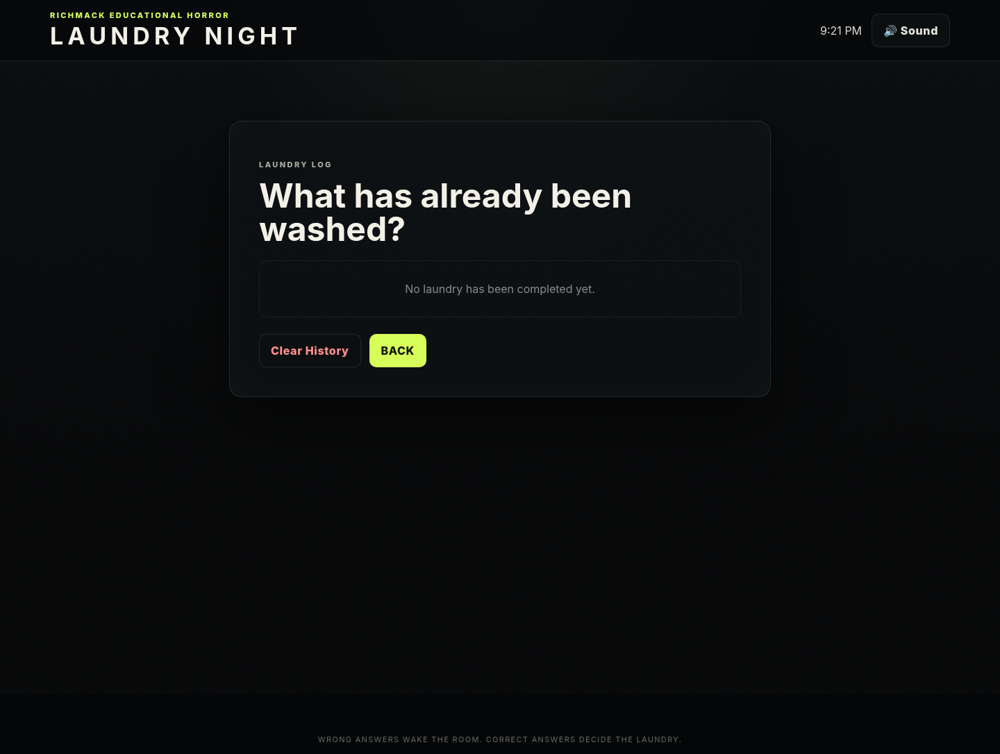

# Laundry Night

[](https://github.com/iamrichmack111/laundry-night/actions/workflows/ci.yml)


A creepy educational laundry-shuffle browser game.

## What it does

- Selects **2 laundry loads each day**.
- Gives each load a **10-question math or spelling challenge**.
- Saves the player's score and letter grade.
- Saves completed laundry in the browser using `localStorage`.
- Loads that have not been completed recently receive a higher chance of being picked.
- Wrong answers raise the game's danger level and make the laundry room creepier.
- Includes a manual **Reshuffle Today** button.
- Includes automated **Playwright smoke tests and screenshots**.
- Runs tests in **GitHub Actions CI** on pushes and pull requests.
- Builds a downloadable ZIP and GitHub Release whenever a `v*` tag is pushed.

## Included laundry categories

- Darks
- Whites
- Towels
- Bedding
- Kids' Clothes
- Parents' Clothes
- Kitchen Towels
- Delicates

## Run it

You can open `index.html` directly in a browser, or serve it locally:

```bash
./start.sh
```

Then open:

```text
http://localhost:8088
```

You can also choose another port:

```bash
./start.sh 8090
```

## Playwright tests + screenshots

Install the test dependency and Chromium once:

```bash
npm install
npx playwright install chromium
```

Run the complete suite:

```bash
npm test
```

Playwright starts its own isolated Node test server on `127.0.0.1:41737`, so it does not depend on the game's normal development port or the current shell directory.

Capture the screenshot suite only:

```bash
npm run screenshots
```

Generated screenshots are written to `screenshots/`:

- `01-main-menu.png`
- `02-daily-assignment.png`
- `03-challenge.png`
- `04-history.png`

## Screenshots

### Main Menu



### Daily Assignment



### Challenge



### History



The repository includes baseline Playwright screenshots in `screenshots/`, so this gallery renders immediately on GitHub. Run `npm run screenshots` whenever you want to refresh them, then commit the updated PNGs.

On GitHub Actions, the screenshots and the HTML Playwright report are also uploaded as downloadable workflow artifacts.

## CI/CD

`.github/workflows/ci.yml` runs on pushes, pull requests, and manual dispatch. It:

1. Checks out the project.
2. Sets up Node.js 22.
3. Installs Playwright.
4. Installs Chromium and Linux browser dependencies.
5. Runs all smoke tests and screenshot tests.
6. Uploads screenshots and the Playwright HTML report.

`.github/workflows/release.yml` runs when you push a tag beginning with `v`, such as `v1.0.0`. It reruns Playwright, packages the game, and creates a GitHub Release with generated notes.

## Tag a release

```bash
git add .
git commit -m "ci: add Playwright screenshots, workflows and badges"
git push
git tag -a v1.0.0 -m "Laundry Night v1.0.0"
git push origin v1.0.0
```

## Customize the loads

Open `game.js` and edit the `LOADS` array near the top of the file.

Each load has:

```js
{ id:'towels', name:'Towels', icon:'🛁', subject:'Math', skill:'addition', desc:'Bath towels...' }
```

Supported math skills are:

- `addition`
- `multiplication`
- `division`
- `fractions`
- `mixed`

Use `subject:'Spelling'` and `skill:'spelling'` for spelling loads.
